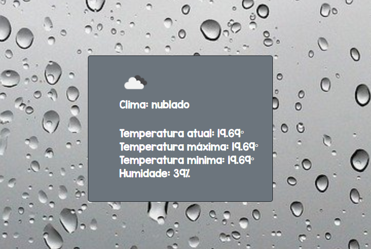

<h2>Olá seja bem vindo(a)</h2>
<p>Esse é mais um dos meus projetos, esse projeto eu fiz usando uma API, essa foi minha primeira vez usando React com uma API, a API que escolhi foi a do <code>OpenWeatherMap</code> nela é possível ver o clima atual, porem eu fiz de um jeito mais divertido, você não precisa botar onde você mora, o site já faz isso para você, assim que você da permissão, o site pega suas coordenadas e mostra o clima atual daonde você está no momento.</p>

Caso queria baixar esse projeto, veja os pré-requisitos.
## 💻 Pré-requisitos

Antes de começar, verifique se você atendeu aos seguintes requisitos:
* Você instalou  `<Node.js>`
* Você tem uma máquina `<Windows / Linux / Mac>`.

## ☕ Usando o Projeto
Caso não saiba usar o terminal, não se preocupe, os links de artigos no final do readme irão te ajudar
Para usar o projeto, siga estas etapas:


* Baixe o projeto

* Abra o prompt de comando do seu computador,

* Entre na pasta do arquivo do projeto com o terminal e rode este comando:

```
<npm start>
```
* Feito isso, uma janela do seu navegador padrão ira se abrir com o projeto.

## 🔗 Links úteis
Como abrir o terminal
* [Windows](https://www.dell.com/support/kbdoc/pt-br/000130703/o-prompt-what-it-is-and-how-to-use-it-on-a-dell-system)
* [Mac](https://support.apple.com/pt-br/guide/terminal/apd5265185d-f365-44cb-8b09-71a064a42125/mac)
* [Linux](https://pt.wikihow.com/Abrir-uma-Janela-do-Terminal-no-Ubuntu)

Como navegar em pastas no terminal
* [Windows](https://medium.com/@adsonrocha/como-abrir-e-navegar-entre-pastas-com-o-prompt-de-comandos-do-windows-10-68750eae8f47)
* [Mac](http://ptcomputador.com/Sistemas/mac-os/206761.html#:~:text=Como%20navegar%20um%20Mac%20atrav%C3%A9s%20do%20terminal&text=Abra%20o%20programa%20%22Terminal%22%20na%20pasta%20%22Utilit%C3%A1rios%22%20.&text=%22ls%22%20sem%20aspas%20%2C%20em,os%20arquivos%20no%20diret%C3%B3rio%20atual%20.&text=%22%20ls%20%2Fcaminho%20%2Fpara%20%2F,os%20arquivos%20no%20diret%C3%B3rio%20desejado%20.)
* [Linux](https://neyntutors.com.br/2017/02/11/como-navegar-entre-os-diretorios-do-linux/)

## 🖼️ Foto do projeto




